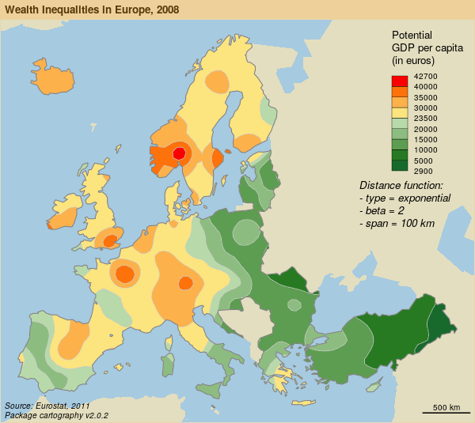

# Outils cartographiques pour la recherche et l’enseignement - Cartographie avec R  
*4 octobre 2018 - Atelier Digit Hum- ENS, Paris*  
*T. Giraud & N. Lambert*  

[Présentation](http://rCarto.github.io/digit_hum/index.html)  
 
  
